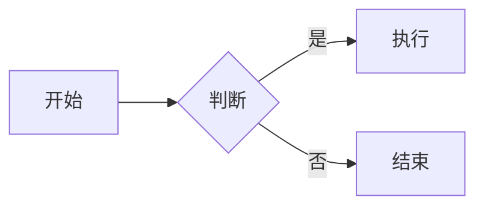

# School Wiki 扩展与插件参考手册


## 一、Python-Markdown 官方扩展

### 1. abbr — 缩写悬停

**源代码**：
```markdown
*[HTML]: Hyper Text Markup Language
*[W3C]: World Wide Web Consortium

HTML 规范由 W3C 维护。
```

**渲染效果**：

*[HTML]: Hyper Text Markup Language
*[W3C]: World Wide Web Consortium

HTML 规范由 W3C 维护。

> 鼠标悬停在带虚线下划线的缩写上会显示完整定义。

---

### 2. admonition — 提示框

**源代码**：
```markdown
!!! note "自定义标题"
    这是一个提示框，支持多行内容。
    缩进 4 个空格。

!!! warning
    这是警告框，标题默认为 "Warning"。

!!! tip ""
    无标题提示框。
```

**渲染效果**：

!!! note "自定义标题"
    这是一个提示框，支持多行内容。
    缩进 4 个空格。

!!! warning
    这是警告框，标题默认为 "Warning"。

!!! tip ""
    无标题提示框。

**常用类型**：`note`、`warning`、`tip`、`danger`、`info`、`success`、`question`、`example`、`quote`、`bug`、`abstract`。

---

### 3. attr_list — 元素属性

**源代码**：
```markdown
这是一个段落。
{: #my-paragraph .highlight }

[外部链接](https://example.com){: target="_blank" }
```

**渲染效果**：

这是一个段落。
{: #my-paragraph .highlight }

[外部链接](https://example.com){: target="_blank" }

> 为块级元素添加 `id`、`class` 等属性，常用于自定义锚点和样式。

---

### 4. def_list — 定义列表

**源代码**：
```markdown
苹果
:   一种蔷薇科植物的果实。

香蕉
:   热带水果，富含钾元素。
:   也可指颜色。
```

**渲染效果**：

苹果
:   一种蔷薇科植物的果实。

香蕉
:   热带水果，富含钾元素。
:   也可指颜色。

---

### 5. footnotes — 脚注

**源代码**：
```markdown
这是一个有脚注的句子[^1]，还有另一个[^note]。

[^1]: 这是第一条脚注的内容。
[^note]: 这是命名脚注，可包含 **格式** 与[链接](https://example.com)。
```

**渲染效果**：

这是一个有脚注的句子[^1]，还有另一个[^note]。

[^1]: 这是第一条脚注的内容。
[^note]: 这是命名脚注，可包含 **格式** 与[链接](https://example.com)。

---

### 6. md_in_html — HTML 内解析 Markdown

**源代码**：
```html
<div markdown="1">
## 这个标题会被解析

- 列表项也会被解析
- **加粗** 同样生效
</div>
```

**渲染效果**：

<div markdown="1">
## 这个标题会被解析

- 列表项也会被解析
- **加粗** 同样生效
</div>

---

### 7. toc — 目录与永久链接

**配置**：
```yaml
- toc:
    permalink: true
```

**效果**：所有标题右侧出现 `¶` 锚点链接，鼠标悬停可见，点击后 URL 带上 `#标题id`，便于分享特定章节。

---

### 8. markdown_tables_extended — 表格单元格合并

**列合并**：
```markdown
| 姓名 | 科目 | 备注 |
|:---:|:---:|:---:|
| 张三 | 数学 || 合并"科目"和"备注" |
```

| 姓名 | 科目 | 备注 |
|:---:|:---:|:---:|
| 张三 | 数学 || 合并"科目"和"备注" |

**行合并**：
```markdown
| 属性 | 值1 |
|:---:|:---:|
| 跨3行 | A |
|  | B |
|_^ _| C |
```

| 属性 | 值1 |
|:---:|:---:|
| 跨3行 | A |
|  | B |
|_^ _| C |

**二维合并**：
```markdown
| 属性 | 详情 | 备注 |
|:---|:---|:---|
| 大单元格（跨2列3行） || | 第一行 |
|  |  | 第二行 |
|_^ _|  | 第三行 |
```

| 属性 | 详情 | 备注 |
|:---|:---|:---|
| 大单元格（跨2列3行） || | 第一行 |
|  |  | 第二行 |
|_^ _|  | 第三行 |


---

## 二、PyMdown Extensions

### 9. arithmatex — 数学公式

**源代码**：
```markdown
行内公式：$E = mc^2$ \(E = mc^2\)

块级公式：

$$
\int_{-\infty}^{\infty} e^{-x^2} dx = \sqrt{\pi}
$$

\[
\int_{-\infty}^{\infty} e^{-x^2} dx = \sqrt{\pi}
\]
```

**渲染效果**：

行内公式：$E = mc^2$ \(E = mc^2\)

块级公式：

$$
\int_{-\infty}^{\infty} e^{-x^2} dx = \sqrt{\pi}
$$

\[
\int_{-\infty}^{\infty} e^{-x^2} dx = \sqrt{\pi}
\]

> 需配合 `extra_javascript` 中的 MathJax 才能实际渲染。

---

### 10. betterem — 增强强调解析

**源代码**：
```markdown
**加粗中的 *斜体* 依然生效**

*斜体中的 **加粗** 依然生效*
```

**加粗中的 *斜体* 依然生效**

*斜体中的 **加粗** 依然生效*

---

### 11. caret — 插入与上标

**源代码**：
```markdown
这段文字 ^^被标记为插入^^。

10^2^ = 100（上标）。
```

**渲染效果**：

这段文字 ^^被标记为插入^^。

10^2^ = 100（上标）。

---

### 12. details — 可折叠块

**源代码**：
```markdown
??? note "点击展开"
    折叠内容，默认关闭。

???+ tip "默认展开"
    折叠内容，默认打开。
```

**渲染效果**：

??? note "点击展开"
    折叠内容，默认关闭。

???+ tip "默认展开"
    折叠内容，默认打开。

---

### 13. emoji — 表情与图标

**源代码**：
```markdown
:smile: :heart: :rocket: :tada:

:material-account: :octicons-mark-github-16: :fontawesome-brands-python:
```

**渲染效果**：

:smile: :heart: :rocket: :tada:

:material-account: :octicons-mark-github-16: :fontawesome-brands-python:

---

### 14. inlinehilite — 行内代码高亮

**源代码**：
```markdown
`#!python print("Hello")`

`:::js console.log("Hi")`
```

**渲染效果**：

`#!python print("Hello")`

`:::js console.log("Hi")`

---

### 15. keys — 键盘按键

**源代码**：
```markdown
按 ++ctrl+alt+del++ 重启电脑。

按 ++cmd+shift+p++ 打开命令面板。
```

**渲染效果**：

按 ++ctrl+alt+del++ 重启电脑。

按 ++cmd+shift+p++ 打开命令面板。

---

### 16. mark — 文本高亮

**源代码**：
```markdown
==这段文字会被高亮显示==
```

**渲染效果**：

==这段文字会被高亮显示==

---

### 17. smartsymbols — 智能符号

**源代码**：
```markdown
(c) (r) (tm) --> <-- 1/4 1/2 3/4 +- !=
```

**渲染效果**：

(c) (r) (tm) --> <-- 1/4 1/2 3/4 +- !=

---

### 18. superfences — 增强代码围栏与 Mermaid

**普通代码块**：
````markdown
```python
def hello():
    print("Hello")
```
````

```python
def hello():
    print("Hello")
```

**Mermaid 图表**：
````markdown

````


---

### 19. tabbed — 标签页

**源代码**：
```markdown
=== "Python"
    ```python
    print("Hello")
    ```

=== "JavaScript"
    ```js
    console.log("Hello")
    ```
```

**渲染效果**：

=== "Python"
    ```python
    print("Hello")
    ```

=== "JavaScript"
    ```js
    console.log("Hello")
    ```

---

### 20. tasklist — 任务列表

**源代码**：
```markdown
- [x] 已完成的任务
- [ ] 未完成的任务
- [ ] 另一个待办事项
```

**渲染效果**：

- [x] 已完成的任务
- [ ] 未完成的任务
- [ ] 另一个待办事项

---

### 21. tilde — 删除线与下标

**源代码**：
```markdown
这段文字 ~~已被删除~~。

H~2~O 是水分子。
```

**渲染效果**：

这段文字 ~~已被删除~~。

H~2~O 是水分子。

---

### 22. highlight — 代码高亮核心

**配置**：
```yaml
- pymdownx.highlight:
    anchor_linenums: true
    line_spans: __span
    pygments_lang_class: true
```

**效果**：为 `superfences` 和 `inlinehilite` 提供底层高亮引擎，支持行号锚点、行级 `<span>` 包裹、语言类名注入。

---

### 23. snippets — 内容片段包含

> `base_path` 已配置为 `docs`，因此路径以 `docs/` 为起点。

---

## 三、MkDocs 插件

### 24. git-revision-date-localized — 页面最后更新日期

**配置**：
```yaml
- git-revision-date-localized:
    enable_creation_date: true
```

**效果**：每个页面底部自动显示"最后更新于 XXXX年XX月XX日"，无需在 Markdown 中写任何代码。

> ⚠️ GitHub Actions 构建时需设置 `fetch-depth: 0`。

---

### 25. tags — 标签系统

**页面打标签**（Front-matter）：
```yaml
---
tags:
  - 数学
  - 数学-代数
  - 复习资料
---
```

**标签索引页**（`docs/tags.md`）：
```markdown
# 标签索引

[TAGS]
```

**配置**：
```yaml
- tags:
    tags_hierarchy: true
    tags_hierarchy_separator: "-"
```

---

### 26. macros — 变量与宏


---

### 27. search — 站内搜索

**配置**：
```yaml
- search
```

**效果**：Material 主题自动在页面顶部显示搜索框，支持实时检索、搜索建议和关键词高亮。

> ⚠️ 一旦声明了其他插件，`search` 必须显式加入 `plugins` 列表，否则会静默消失。

---

### 28. meta — 批量元数据

**目录级 `.meta.yml`**（`docs/数学/.meta.yml`）：
```yaml
tags:
  - 数学
  - 核心课程
template: custom.html
```

**效果**：该目录及所有子目录下的页面自动获得这些元数据，无需逐页添加。

---

### 29. redirects — 页面重定向

**配置**：
```yaml
- redirects:
    redirect_maps:
      'old.md': 'new.md'
      'legacy.md': 'https://external.com/page'
```

**效果**：文件移动或重命名后，旧链接自动跳转到新位置，避免 404。

---

## 四、快速索引

| 类别 | 名称 | 用途 |
|:---:|:---:|:---|
| **官方扩展** | abbr | 缩写悬停 |
| | admonition | 提示框 |
| | attr_list | 元素属性 |
| | def_list | 定义列表 |
| | footnotes | 脚注 |
| | md_in_html | HTML 内解析 Markdown |
| | toc | 目录与永久链接 |
| | markdown_tables_extended | 表格合并 |
| **PyMdown** | arithmatex | 数学公式 |
| | betterem | 增强强调 |
| | caret | 插入与上标 |
| | details | 可折叠块 |
| | emoji | 表情与图标 |
| | inlinehilite | 行内代码高亮 |
| | keys | 键盘按键 |
| | mark | 文本高亮 |
| | smartsymbols | 智能符号 |
| | superfences | 代码围栏与 Mermaid |
| | tabbed | 标签页 |
| | tasklist | 任务列表 |
| | tilde | 删除线与下标 |
| | highlight | 代码高亮核心 |
| | snippets | 内容片段包含 |
| **插件** | git-revision-date-localized | 最后更新日期 |
| | tags | 标签系统 |
| | macros | 变量与宏 |
| | search | 站内搜索 |
| | meta | 批量元数据 |
| | redirects | 页面重定向 |

---

## 五、组合示例

以下是一个综合运用多种扩展的示例：

=== "源代码"
    ````markdown
    !!! tip "小提示"
        这是一个提示框，内部可以使用 ==高亮== 和 `代码`。

    | 功能 | 语法 | 效果 |
    |:---:|:---:|:---:|
    | 高亮 | `==文字==` | ==文字== |
    | 删除 | `~~文字~~` | ~~文字~~ |
    | 插入 | `^^文字^^` | ^^文字^^ |
    | 上标 | `x^2^` | x^2^ |
    | 下标 | `H~2~O` | H~2~O |

    ```mermaid
    graph TD
        A[开始] --> B[结束]
    ```
    ````

=== "渲染效果"
    !!! tip "小提示"
        这是一个提示框，内部可以使用 ==高亮== 和 `代码`。

    | 功能 | 语法 | 效果 |
    |:---:|:---:|:---:|
    | 高亮 | `==文字==` | ==文字== |
    | 删除 | `~~文字~~` | ~~文字~~ |
    | 插入 | `^^文字^^` | ^^文字^^ |
    | 上标 | `x^2^` | x^2^ |
    | 下标 | `H~2~O` | H~2~O |

    ```mermaid
    graph TD
        A[开始] --> B[结束]
    ```
